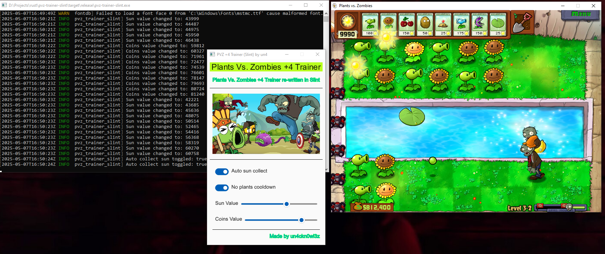

# pvz-trainer-slint

A modern +4 trainer for **Plants vs. Zombies**, rewritten with [Slint UI](https://slint.dev) for speed, simplicity, and cross-platform support. This tool allows you to tweak in-game memory values in real time.

 

## ✨ Features

✅ **+4 Trainer:**
- 🌞 **Sun Hack** – Instantly set or freeze your sun amount  
- 💰 **Coin Hack** – Instantly set or freeze your coins  
- 🌿 **No Plant Cooldown** – Remove cooldowns so you can plant rapidly  
- ☀️ **Auto Collecting Sun** – Automatically collect falling sun and sun from sunflowers  

## 🖥️ Built With

- [Slint](https://slint.dev) – UI toolkit for building native GUIs in Rust, C++, and more
- 🦀 Rust – language used for memory editing

## 🛠️ How to Build

```bash
git clone https://github.com/un4ckn0wl3z/pvz-trainer-slint.git
cd pvz-trainer-slint
cargo build --release
```

## 🚀 How to Use
- Launch Plants vs. Zombies (tested on version 1.2.0.1073)
- Run the pvz-trainer-slint executable
- Use the GUI to activate hacks
- Enjoy dominating the zombie hordes!

## ⚠️ Disclaimer
This project is for educational purposes only. Do not use it in conjunction with pirated software. All rights to Plants vs. Zombies belong to PopCap / EA.

## 📄 License
MIT License
